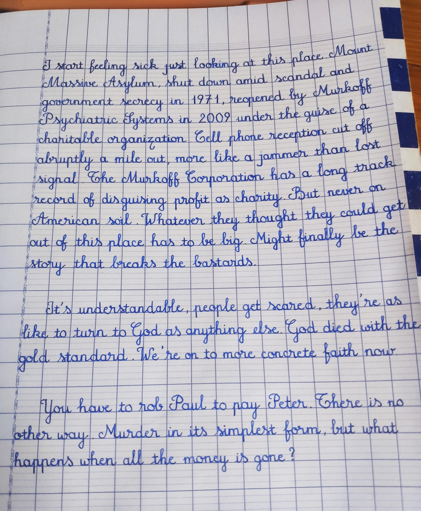

# Ollama Vision OCR

[](https://www.python.org/downloads/)
[](https://streamlit.io)
[](https://ollama.ai)

Extract text and content from images using Ollama's vision models and Streamlit. Convert any image into structured, well-formatted Markdown text.

<p align="center">
  
</p>

## Features

- Image upload support (PNG, JPG, JPEG)
- AI-powered OCR using Qwen3-VL:2B model
- Structured Markdown output
- Clean and intuitive Streamlit interface
- Real-time content extraction
- Clear button to reset results

## Prerequisites

- Python 3.8+
- [Ollama](https://ollama.ai) installed with `qwen3-vl:2b` model

## Installation

```bash
# Pull the Ollama model
ollama pull qwen3-vl:2b

# Install Python dependencies
pip install streamlit ollama pillow

# Run the application
streamlit run app.py
```

## Usage

1. Open your browser and navigate to `http://localhost:8501`
2. Upload an image (PNG, JPG, or JPEG) containing text or content
3. Click the **"Extract Content"** button
4. View the extracted content in structured Markdown format
5. Use the **"Clear"** button to reset and process a new image

## How It Works

The application leverages Ollama's `qwen3-vl:2b` vision model to:
- Analyze images for text and content
- Extract readable text with proper formatting
- Present results in clean, well-organized Markdown format
- Support headings, lists, code blocks, and other Markdown elements

## Technologies

- **[Ollama](https://ollama.ai)** - Local AI model inference
- **[Streamlit](https://streamlit.io)** - Web application framework
- **[Qwen3-VL](https://github.com/QwenLM/Qwen3-VL)** - Vision language model
- **Pillow** - Image processing

## License

MIT License